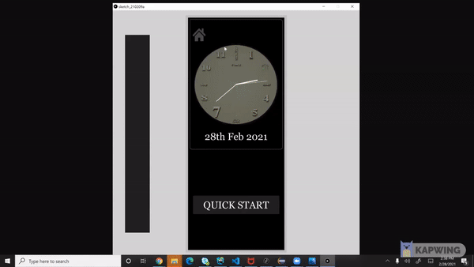
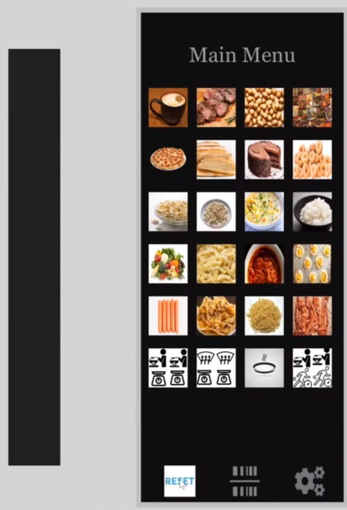

## CS 5331 - Human Computer Interaction
## April, 2021
## Umejiaku Promise Afamefuna
## This is an implementation of a proposed Microwave Control Interface
## Assigment Question
Find an microwave in the apartment/campus/hotel. Only one example for each student.
Take photos of the control interface.
Show a gif image of the control interface in operation.
Find the issues with the current design and explain why it is bad.

To get a B, you need to:
List your most common uses and other more rare uses of a microwave. Does the interface make doing those common things easier?
Think about how the user interacts with the microwave. What is the common sequence of actions?
How does the microwave support the user figure out how to make it work?
How does the microwave provide feedback to the user?
What are some common mistakes you can make with this current design?
Suggest the improvements to make on the control interface. Sketch your solution and justify your design decisions.
Here is an example of Low-Fidelity Prototype sketching out the design (for a different purpose).

Now, imagine that you can have a touch screen on the microwave. To get a A, you need to:
Come up with your design for the touch screen? What is the screen size that you want?
Design and implement interactive features
Design and implement user feedback
You use Processing for this project.
You can get extra credits if:
Your design supports people with disabilities
You provide extra useful information on the display interface.
Your imagination

## My Solution
The solution for the above questions can be found at this website 
[Microwave Interface](https://afamumejiaku.github.io/Microwave-Interface-Design/) 
 

Video of solution
[ Click the image below to watch a short video demo.](https://www.youtube.com/embed/4ss72XnrnDA)  
 

